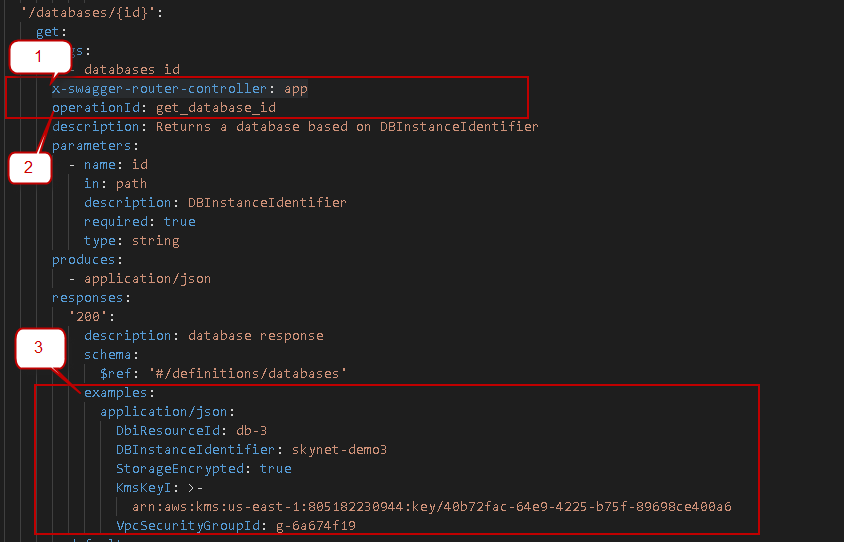

# Connexion Mock Server Example
> This repo is to demo mock server using connexion_mock
> The tool can provide 2 kinds of responses : 
- static response:  return examples from swagger.yaml
- dynamic response: return response from user provided python script 

# Requirements:
- docker


### To start All lucy services ( static mocks)

```sh
./mock_all.sh /tmp/lucy_mocks 5000

# output from the above commands
------------------------------------
Done
------------------------------------
inventory-service        : http://192.168.16.86:5000/inventoryService/v1/ui
credentials-service      : http://192.168.16.86:5001/cs/v1/ui
user-management-service  : http://192.168.16.86:5002/um/v1/ui
rule-service             : http://192.168.16.86:5003/rs/v1/ui
compliance-service       : http://192.168.16.86:5004/complianceservice/v1/ui

```


###  To start a single mock server in staic or dynamic mode
```sh
cd rule-service
docker login hub.gitlab-sj.thalesesec.com (with your access token)

docker run -it --rm  --name s1 -p 9001:8080 -v $(pwd):/data hub.gitlab-sj.thalesesec.com/lucy/mock_example/run_mock:latest static

docker run -it --rm --name s1 -p 9001:8080 -v $(pwd):/data hub.gitlab-sj.thalesesec.com/lucy/mock_example/run_mock:latest dynamic 
# To  test mock server
curl -v http://localhost:9001/{baseURL}/ui
```


## To support Static Responses:

- 'swagger.yaml' must under **repo root**.
- For **every 200 response operation** which has reponse body, you will need to add 'x-swagger-router-controller', 'operationId' and 'examples'  (see pictures)
- No example needed for operation which does *NOT* have response body. 
- connexion mock will automtically return error response if request parameters failed to meet the schema 
- Please refer [swagger examples usecases](examples : https://swagger.io/docs/specification/adding-examples/) for how to add examples




## To Support Dynamic Response :
- create a **mock_connexion**  folder  under repo root by copying *mock_connextion* in this repo
- update app.py replace all function with your endponts operationalId.
- Every operationId in swagger.yaml  *must* has a matching function in app.py
- **IMPORTANT** : When a new API added to swagger.yaml. Please also add a matching function in app.py
- Producer provide the mock stub template. Consumers should add implemention in app.py and commit to producer's repo ( such that multiple consumers can share the mock)
- Dry run with docker : ( see below section 'How to start mock server ?' )
- Dry run with python virtualenv :
```
cd mock_connexion
source .ENV.sh
# you will enter python virtualenv
.(venv) ipython3 app.py ../swagger.yaml
```

## How to start mock server?
### step1 : checkout micro service repo 
- Check out utils and placed on anywhere on your machine  
example 
```
git clone git@git.gitlab-sj.thalesesec.com:lucy/rule-service.git
```

